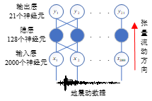
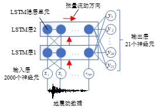
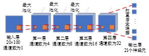

# DispAglPred
This is the source file of article "Prediction of interlayer displacement angle of frame shear wall structure based on convolutional neural network"(in chinese).

## Introduction
In this study, a method of processing ground vibration records into a two-dimensional tensor is proposed to solve the problem of ground vibration records being difficult to be used as network input. A frame shear wall structure is selected as an example of the algorithm, and the time-range response of the structure under 100 seismic waves is calculated and made into a dataset. Three network models, CNN, ANN, and LSTM, were constructed, and the processed data were input into the network for training, and the inter-story displacement angle of the structure was predicted using the trained network. By analyzing the training results of the three networks, it was found that CNN outperforms ANN and LSTM both in terms of accuracy and training speed.

## Network structure

The three structures of neural networks is listed as follows.

This is the ANN structure:

This is the LSTM structure:

This is the CNN structure:

## Network hyperparameterization
This is the list of hyperparameterizations this three networks.

|训练参数|ANN|LSTM|CNN|
|----|----|----|----|
|训练轮数|50|150|400|
|优化器|Adam|Adam|Adam|
|学习率|0.0001|${10}^{-6},{10}^{-8}$|${10}^{-7},{10}^{-8}$|
|损失函数|MSE|MSE|MSE|
|批大小|4|4|4|

## Network training and testing
The training log and testing log are saved in file of "data.rar". Where the loss file for the training process corresponds to each saved .pt file.